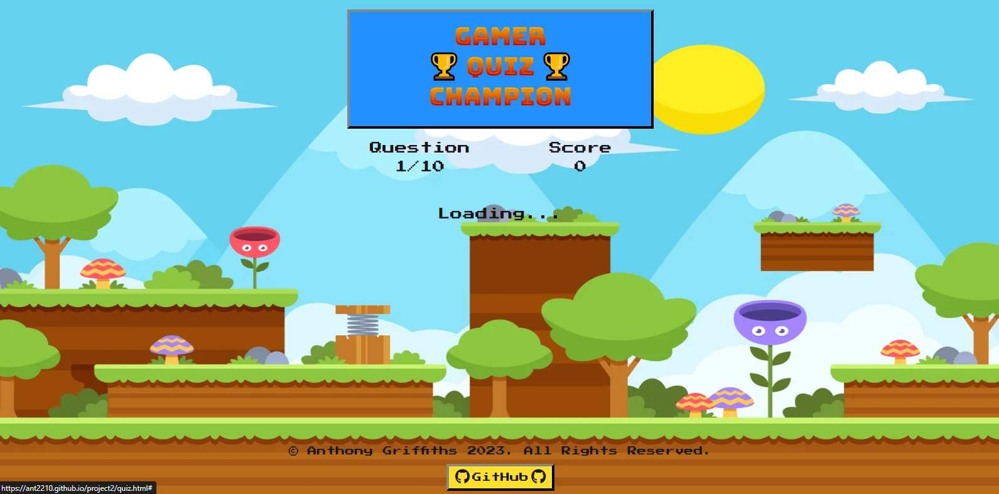
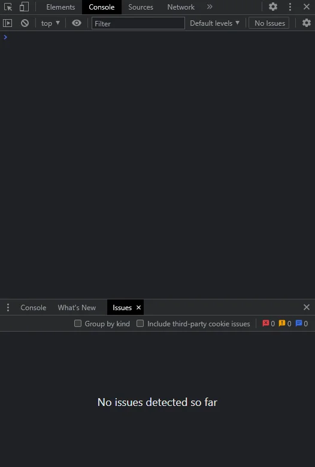
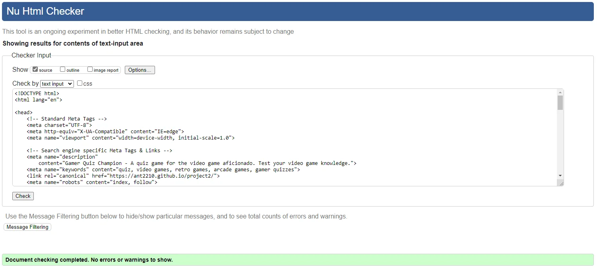

<h1 align="center" id="title"></h1>

Gamer Quiz Champion is a quiz game for the video game aficionado. Answer 10 questions all about video games and try and beat the top score. 

There are three levels of difficulty, easy questions score 10 points, medium questions score 15 points and hard questions score 20 points!

[View the live project here.](https://ant2210.github.io/project2/)

## User Experience (UX) 

### User stories

#### First Time Visitor Goals

-  As a first time visitor, I want to find out find out what the quiz is about and how to play.
-  As a first time visitor, I want to be able to navigate the site quickly and easily, it should be intuitive and obvious what to do next.
-  As a First Time Visitor, I want to be able to play the quiz any time and on any of my internet connected devices and therefore responsive. 
-  As a First Time Visitor, I want the quiz to be fun and inviting. 

#### Returning Visitor Goals

-  As a returning visitor, I want to be able to keep track of my previous scores so I can try and improve upon it. 
-  As a returning visitor, I want to be able to adjust the difficulty as my knowledge improves.
-  As a returning visitor, I don't want to answer the same questions over and over so as not to get board of the quiz too quickly.

#### Frequent User Goals
       
- A frequent users requirements would be much the same as a returning visitor given fairly basic nature of the quiz. A frequent user may however want to be able to compare scores with friends.

### Design
#### Colour Scheme
The main considerations for the colour scheme were aesthetics and accessibility. As this is a video game quiz I decided to go for a retro theme and the blue colour chosen is reminiscent of the rolling sky backgrounds found in a lot of retro games, which is then further complemented by the background image chosen.

When choosing the main text colour, I wanted a dark contrasting colour but didn't want to use black `#ffffff` as I found this to be quite harsh, so opted for a slightly softened black/grey colour.

I then used a colour picker to select a backup background colour the same colour as the sky in the background image. This however doesn't effect accessibility in any way as all text is overlaid within a "container" which is the main blue colour.

When Selecting the button colours I wanted something basic but vibrant that still sticks with the retro them but contrasts well against the blue colour. During the main quiz the buttons flash green for correct answers and red for incorrect answers which are fairly intuitive colours for this purpose.

-   ##### Colours Used
    - Main colour theme - `#2290fd`
    - Text colour - `#161616`
    - Backup background colour - `#65D3F0`
    - Main Button colour - `#ffdf29`
    - Correct answer button colour - `#009D00`
    - Incorrect answer button colour - `#ff0000`

#### Colour Accessibility
			
When deciding on the shade of blue and black to use, I used Coolors.co contract checker tool  which can be found [here](https://coolors.co/contrast-checker/000000-ffffff), to ensure the colours chosen met the WCAG 2.1 AA guidelines as minimum and AAA guidelines where possible. 

I also checked the contract for the text against each button colour used.  

For further information on these guidelines, you can visit the following link. [Web Content Accessibility Guidelines (WCAG) 2.1 (w3.org)](https://www.w3.org/TR/WCAG21/).
        

- ##### Colour Palette and Results
    - Main Colour Theme - [Coolors Contrast Checker](https://coolors.co/contrast-checker/161616-2290fd) 
    

    - Main Button Colour - [Coolors Contrast Checker](https://coolors.co/contrast-checker/161616-ffdf29) 
    

    - Correct Button Colour - [Coolors Contrast Checker](https://coolors.co/contrast-checker/161616-009D00) 
    

    - Incorrect Button Theme - [Coolors Contrast Checker](https://coolors.co/contrast-checker/161616-ff0000) 
         

#### Typography
The main considerations for the font were again aesthetics and accessibility. In sticking with the retro video game theme, I found two suitable fonts on Google fonts. 

- ##### Title / Heading

    For the main Title/Heading I chose a font called Bungee Spice from Google Fonts which can be found [here](https://fonts.google.com/specimen/Bungee+Spice?query=bungee). This was mainly used for the aesthetic quality to create logo like title using HTML emojis also. This font wasn't used for anything else within the site. 

 - ##### Main Font

    The main font used throughout the rest of the page was a Google Font called Press Start 2P which can be found [here](https://fonts.google.com/specimen/Press+Start+2P?query=2p). This again was chosen for aesthetics and in keeping with the retro video game theme.

 - ##### Fallback Font

    For my fallback font I have opted for the Arial font, part of the sans-serif family. It is the most widely used font for both online and printed media. Arial is said to be one of the safest web fonts, and is available on all major operating systems. 

#### Imagery

 - ##### Background Image
    The background image was sourced from Freepik and can be found [here](https://www.freepik.com/free-vector/video-game-background-design_40127923.htm#query=retro%20game%20clouds%20and%20grass&position=12&from_view=search&track=ais).

- ##### Favicon
    The favicon was created using a standard HTML emoji and was then edited using [Pixlr E](https://pixlr.com/e/) to remove the background. I then used [CloudConverter](https://cloudconvert.com/) to covert from PNG to a .ico file.

All other imagery on the website are basic emojis and inserted using the HTML Emoji References.

### Wireframes
The wireframes were creates using [Figma](https://www.figma.com/files/recents-and-sharing?fuid=1196127801458429486).

[Back to top](#title)  

### Features

-   Fully responsive across all screen sizes.

    -   Laptop / Desktop
    
    
    

    -   Tablet
    
    
    

    -   Mobile
    
    
    

-   Intuitive and easy to navigate using the various buttons throughout the page.

    
    
    
    

-   A "How To Play" section detailing the purpose of the quiz as well as how to play.

    
-   A Leader Board which saves the users score to the local storage allowing them to keep track of their high scores.

    
    

-   A Heads Up Display which shows the user which question they are on and how many they have left as well as their current score.

    
-   A difficulty selector allowing the user to select three levels of difficulty for the quiz.
    

-   A quit button, allowing the user to quit the quiz and go back home at any point. This is also connected to a warning modal informing the user that their progress will not be saved if they choose to quit the quiz.

    
    

-   A "Skip & Go Home" button allowing the user to skip saving their high score if they don't want to. 

    

-   All questions are loaded at random from an external API, allowing for a large amount of questions without have them be saved locally to the site. 

    

-   A loading screen which is shown whilst questions are being retrieved from the external API so the user isn't staring a blank page, or page with placeholder text.

    

-   An error modal which informs the user if there has been an issues whilst retrieving the questions from the external API.

    

-   Another error modal that appears if the user tries to save their score without entering any text into the username field.

    

-   A responsive footer with a link to the creators GitHub account.

    

-   A 404.html error page that automatically redirects users back to the homepage if a page cannot be found.

    

### Future Features

-   I would like to implement a social share button so that users can share their scores with their friends on social media.
-   I would like to implement some in game retro style audio to make the quiz more fun.
-   I would like to implement either a database that holds the high scores or use an external API to with social features so that the users high scores can be made public and shared with friends via social media. 

### Accessibility
-   The use of semantic HTML.
-   Ensuring the colours and text use meet accessibility standards set by [w3.org](https://www.w3.org/TR/WCAG21/).
-   Ensuring all clickable buttons and links are tabbable using the keyboard.
-   Using descriptive alt tags on all images.
-   Using correct aria labels where necessary.
-   Being mindful in the creation of the design to ensure it is intuitive and as easy to navigate as possible.

[Back to top](#title)  

## Technologies Used

### Languages Used
-   HTML
-   CSS
-   Vanilla javaScript

### Frameworks, Libraries & Programs Used

-   [Bootstrap](https://getbootstrap.com/) Version 5.3.0 - For the layout and framework of the website, it was also used to create the various modals which were then restyled to math the rest of the website.
-   [Can I Use](https://caniuse.com/) - To check browser support for website features.
-   [Cloud Convert](https://cloudconvert.com/) - To compress and convert images to webp.
-   [Coolors](https://coolors.co/) - To check contrast and accessibility of the colours I chose to use.
-   [Figma](https://www.figma.com/) - To create the wireframes.
-   [Font Awesome](https://fontawesome.com/) - Used for the GitHub icon used in the footer button.
-   [Git](https://git-scm.com/) - For version control.
-   [GitHub](https://github.com/) - To store website files and repository for the website.
-   [Visual Studio Code](https://code.visualstudio.com/) - Was used as my code editor to write code, version control using git and pushing changes for storage to GitHub.
-   [Google Fonts](https://fonts.google.com/) - To import the fonts I chose for the website.
-   Google Dev Tools - Built into the chrome browser to test features and design and troubleshoot as I went along as well as for testing later on, these sections of the website which were then edited myself inside of Visual Stdio Code.
-   [Am I Responsive](https://amiresponsive.co.uk/) - To create the website mockup images at the top of the README.
-   [Pixlr](https://pixlr.com/e/) - To edit images such as the favicon and website mockup.
-   Lighthouse - Built into Google Dev Tools for testing.
-   [W3C](https://www.w3.org/) - To validate and test HTML and CSS code.
-   [JSHint](https://jshint.com/) - To validate and text javaScript code.
-   [Open Trivia Database](https://opentdb.com/) - Is the external API used to retrieve the questions for the quiz.

[Back to top](#title)  

## Testing

### Manual Testing

Extensive testing was carried out throughout the life cycle of this project. As well as all of the documented testing below I asked friends and family to use the site and tell me what was and wasn't working. 

### Bugs

-   Bug 1: The "For each" method in javaScript was not working on the choices buttons as it was a HTML collection not an Array. I found a method to convert a HTML Collection to an array [here](https://nikitahl.com/convert-array-like-collections-to-array/).

-   Bug 2: The quiz continuously looped through questions because the availableQuestions variable was being set every time a new question was requested. I moved this section to the startGame function so it is only called once. This was eventually moved inside the callAPI function when I was reformatting the code to make it as efficient as possible.

-   Bug 3: If the user clicked quick enough they could click multiple answers on the same question, which effected the game progress and score. I separated the checkAnswer function to an awaitAnswer function where the event listener is added and then a checkAnswer function where the event listener is removed before proceeding the check the correct answer and progressing with the rest of the game. 

-   Bug 4: If a scroll bar is present on the page when a modal is opened it is no longer centered. I found solution [here](https://stackoverflow.com/questions/25070144/bootstrap-modal-removes-scroll-bar) but found no other way other than using the !important tag in CSS to override the standard bootstrap styling of the modal.

-   Bug 5: During manual testing I found the error handling message wasn’t launching as expected. This led me to research a method that caught all errors and console log them correctly whilst displaying the error modal to the user.  Try/Catch Method found [here](https://wesbos.com/javascript/12-advanced-flow-control/71-async-await-error-handling).

-   Bug 6: When there are no saved scores a default message is saved on the leader board which was originally incorrectly placed inside the `<ol>` tags. When I moved this text outside of the `<ol>` tags it was no longer being replaced by the high scores list but appearing above it. I altered the code slightly so that the content of the whole model body was replaced by the new list which solved this issue.

### Console Warnings & Errors

-   Warning 1: ARIA hidden element must not contain focusable elements. 

    This pertains to the bootstrap modals. As is argued a GitHub post that can be found [here](https://github.com/twbs/bootstrap/issues/29769). There is no adverse effect to removing the aria-hidden attribute and is in line with accessibility guidelines so I have removed it from my modals.

    

-   Warning 2: Links must have discernible text: Element has no title attribute. 

    This is in reference to the choices and difficulty buttons which are `<a>` tags styled as buttons, and the “invisible” links used to launch the quit modal and error message modal. 
    
    I was using `<a>` tags with no inner text so they would not be visible and referencing them in the javaScript code to launch the modals. 

    To rectify this the choice buttons were given Aria labels as they are empty until filled in by the API. The “invisible” links were removed altogether as there is no reason for a user to need to manually open the error modal and the quit link was redundant as there is a visible button to use. I found a better method to launch them using only javaScript found [here](https://stackoverflow.com/questions/62827002/bootstrap-v5-manually-call-a-modal-mymodal-show-not-working-vanilla-javascrip). 
    
    This also led me to a bug with the error handling for the API. See bug 5.

    

-   Warning 3: Links must have discernible text: Element has no title attribute. 

    This is Same issue as warning 2 with the “invisible” links used to launch the modals, rectified as per warning 2.

    

-   Warning 4 & 5: Error with Permissions-Policy header: Origin trial controlled feature not enabled: 'interest-cohort'. 

    This was an error I encountered on my previous project which after some research it seems this tells google whether or not you would opt into FLoC and can be safely ignored for the purposes of this project.

    Uncaught TypeError: Cannot read properties of null (reading 'map') at highscores.js:10:29. 

    This is an error that only occurs when there are no high scores currently saved to local storage and the highScores array is empty. I fixed this by initialising an empty array if there is no highScores array to parse from the local storage.

    

No further issues found in the Dev Tools Console.

### Devices Used For Testing

The site has altogether in one way or another been used and tested on the following devices...

-   Google Pixel 7 - Chrome
-   HP Elitebook (Windows) - Chrome, Edge and Firefox
-   Iphone SE - Safari and Chrome
-   Ipad - Safari and Chrome
-   Macbook Pro - Safari and Chrome
-   Samsung Galaxy Tab S7 - Chrome and Samsung Browser
-   Samsung S23 Ultra - Edge, Chrome, Firefox and Samsung Browser

### Testing User Stories from User Experience (UX) Section

-   #### First Time Visitor Goals

    -  As a first time visitor, I want to find out find out what the quiz is about and how to play.
        -   This is accomplished by placing a prominent button on the home screen labelled "How To Play" which gives the user some info about the quiz as well as how the quiz works. 
        
        
        
        

    -  As a first time visitor, I want to be able to navigate the site quickly and easily, it should be intuitive and obvious what to do next.
        -   This is accomplished by having the buttons labelled as clearly as possible, but also by the use of the "How To Play" modal which gives clear instructions on how to navigate through the quiz. There are also various modals that provide the user with prompts if there is any errors or if they try to quit the quiz mid game.
        
        
        
        

    -  As a First Time Visitor, I want to be able to play the quiz any time and on any of my internet connected devices and therefore responsive. 
        -   This is accomplished by ensuring responsive design so that the quiz looks good and is usable on devices of all sizes.
            -   Tablet
            
            
            

            -   Mobile
            
            
            
    -  As a First Time Visitor, I want the quiz to be fun and inviting. 
        -   This is accomplished purely through design, and whilst people will have different preferences I have tried to appeal to games by using a retro gaming style them throughout the project.

-   #### Returning Visitor Goals

    - As a returning visitor, I want to be able to keep track of my previous scores so I can try and improve upon it.
        -   This is accomplished by the use of the leader board which can be found on the home screen. 
        
        
    -  As a returning visitor, I want to be able to adjust the difficulty as my knowledge improves.
        -   This is accomplished by the use of the difficulty selector which is presented at the start of every quiz.
        
    -  As a returning visitor, I don't want to answer the same questions over and over so as not to get board of the quiz too quickly.
        -   This is accomplished by the use of an external API which serves randomly selected questions from a large database of questions. Whilst it doesn't state on the website specifically that the questions are pulled at random on each request, testing has revealed that this is the case and only on a few occasions have I received a few of the same questions from previous games. 

-   #### Frequent User Goals

    - A frequent users requirements would be much the same as a returning visitor given fairly basic nature of the quiz. A frequent user may however want to be able to compare scores with friends.
        -   This could be accomplished by implementing some of the [Future Features](#future-features) mentioned above such as adding a social share button and public leader board, which I hope are features I can work on at the end of the course.

### Further Testing

#### HTML Validator - [W3C](https://validator.w3.org/)

- ##### Homepage

- ##### Quiz Page

    - Warning - There is a warning as there is an empty `<h2>` element on the page, I have ignored this however as the `<h2>` is for the question field which is programmatically completed using javaScript.

- ##### End Page

- ##### 404 Error Page

#### CSS Validator - [W3C](https://jigsaw.w3.org/css-validator/)

- ##### styles.css

    - Warnings - Warnings ignored as they only pertain to the imported fonts from Google Fonts.

- ##### quiz.css

- ##### end.css

#### JSHint Validator - [W3C](https://jshint.com/)

- ##### quiz.js

    - Warning - One of the fixes I used to solve "Warning 2" in [Console Warnings & Errors](#console-warnings--errors) was to call some of the modals using javaScript only, [this](https://stackoverflow.com/questions/62827002/bootstrap-v5-manually-call-a-modal-mymodal-show-not-working-vanilla-javascrip) was the only method I could find but this now shows "bootstrap" is an undefined variable in jshint. The fix itself works and it causes no further errors, and doesn't effect usability.

- ##### end.js

    - Warning - One of the fixes I used to solve "Warning 2" in [Console Warnings & Errors](#console-warnings--errors) was to call some of the modals using javaScript only, [this](https://stackoverflow.com/questions/62827002/bootstrap-v5-manually-call-a-modal-mymodal-show-not-working-vanilla-javascrip) was the only method I could find but this now shows "bootstrap" is an undefined variable in jshint. The fix itself works and it causes no further errors, and doesn't effect usability.

- ##### highscores.js

- ##### 404 Error Page

#### Lighthouse

- ##### Desktop

- ##### Mobile

[Back to top](#title)  

## Deployment

### GitHub Pages

The project was deployed to GitHub Pages using the following steps...

1. Log in to GitHub and locate the GitHub Repository.
2. At the top right hand corner of the screen click on your avatar and select 'Your repositories' from the dropdown menu.
3. Select the repository you would like to deploy from your list of repositories.
4. Near the top centre of the repository (not top of the page), locate and click the settings button on the menu.
5. Locate the 'Pages' option on the left hand menu of the settings page.
6. Ensure the 'Source' option says 'Deploy from a branch'.
7. Under Branch' change the 'None' option to 'main' then press the 'Save' button to the right.
8. Under branch it should now say "Your GitHub Pages site is currently being built from the main branch."
9. Wait a few minutes for the page to refresh (this can take up to 5 minutes but usually only 2-3 minutes).
10. You may have to refresh the page at this point, once completed at the top of the page you will see your site it live with the link to the live site. 
11. If you are unsure and want to check the progress you can click on 'Code' along the top menu of the setting (not top of the screen).
12. Under 'Environments' on the right hand side you will see github-pages.
13. Clicking this link will tell you if your page is queue, in progress or active.
14. You will also find the link here to your deployed page or by going back to the 'Setting' options and locating the 'Pages' section again, where you will find the link once your site has been published.

### Forking the GitHub Repository

By forking the GitHub Repository we make a copy of the original repository on our GitHub account to view and/or make changes without affecting the original repository by using the following steps...

1. Login to GitHub.
2. Locate the repository, you can use a link you have been provided with or use the search function in the top left of the screen.
3. In the top right hand corner of the page locate and click the 'fork' button.
4. Near the bottom of the page click the green button that says 'Create Fork'.
5. You should now have a copy of the original repository in your GitHub account.

### Making a Local Clone

1. Login to GitHub.
2. Locate the repository, you can use a link you have been provided with or use the search function in the top left of the screen.
3. Near the top of the repository click the green 'Code' button.
4. To clone the repository using HTTPS, under HTTPS copy the link provided.
5. Open the terminal in your code editor. 
6. Change the current working directory to the location where you want the cloned directory to be made.
7. Type git clone, and then paste the URL you copied in Step 3.
8. Press Enter. Your local clone should be created.

[Back to top](#title)  

## Credits

### Code

-   Social Media Integration for Facebook, LinkedIn & Google - Code from [Abi Harrison Meta Tags Webinar](https://www.youtube.com/watch?v=t-4qqmikIqk).
-   Scroll Bar Up Button - Advice on styling scroll bar buttons found on Stack Overflow [here](https://stackoverflow.com/questions/47576815/how-to-add-arrows-with-webkit-scrollbar-button).
-   Tutorial for saving high scores to the local storage by James Q Quick found [here](https://www.youtube.com/watch?v=DFhmNLKwwGw).
-   Advice for checking the value of an input field using javaScript for on Stack Overflow [here](https://stackoverflow.com/questions/3937513/javascript-validation-for-empty-input-field).
-   I found the code used to randomize an array in this [Sling Academy Article](https://www.slingacademy.com/article/;ways-to-shuffle-an-array-in-javascript/?utm_content=cmp-true.).
-   Method used to convert a HTML Collection to an array found [here](https://nikitahl.com/convert-array-like-collections-to-array/).
-   [Bootstrap](https://getbootstrap.com/) was used for general page layout and styling.
-   I found a solution to call a Bootstrap modal using javaScript on Stack Overflow [here](https://stackoverflow.com/questions/62827002/bootstrap-v5-manually-call-a-modal-mymodal-show-not-working-vanilla-javascrip). 
-   I found an article for handling error in asynchronous code [here](https://wesbos.com/javascript/12-advanced-flow-control/71-async-await-error-handling).
- I used code found on Stack Overflow [here](https://stackoverflow.com/questions/25070144/bootstrap-modal-removes-scroll-bar) to inherit the main pages scroll properties when a modal is launched.

All other code was written by the developer.

### Content

-   Static content for this website was all written by the developer.
-   All questions and answers for the quiz are obtained from the [Open Trivia Database](https://opentdb.com/) API. 

### Media

-   Logo - The logo was created using a [Google Font](https://fonts.google.com/specimen/Bungee+Spice?query=bungee) called Bungee Spice and two trophy emojis &#127942; rendered in HTML with code `&#127942;`.
-   Favicon The favicon was created using the same trophy emoji &#127942; and was then edited using [Pixlr E](https://pixlr.com/e/) to remove the background. I then used [CloudConverter](https://cloudconvert.com/) to covert from PNG to a .ico file.
-   Background Image - The background image was sourced from [Freepik](https://www.freepik.com/free-vector/video-game-background-design_40127923.htm#query=retro%20game%20clouds%20and%20grass&position=12&from_view=search&track=ais).

### Acknowledgements

I 100% couldn't have completed this project on my own so would like to acknowledge the following people for their contributions, whether they know they helped or not...

-   My Fiancé and children for their unwavering support.
-   [Iris Smok](https://github.com/Iris-Smok) my cohort facilitator for her support and for checking in on me when I have had to take some time away from the keyboard.
-   [Martina Terlevic](https://github.com/SephTheOverwitch) for her advice and support.
-   The [Code Institute](https://codeinstitute.net/) student support for checking in on me when it seems I might have gone MIA.
-   The people on my cohort for their support, encouragement and reviewing my project.

[Back to top](#title)  